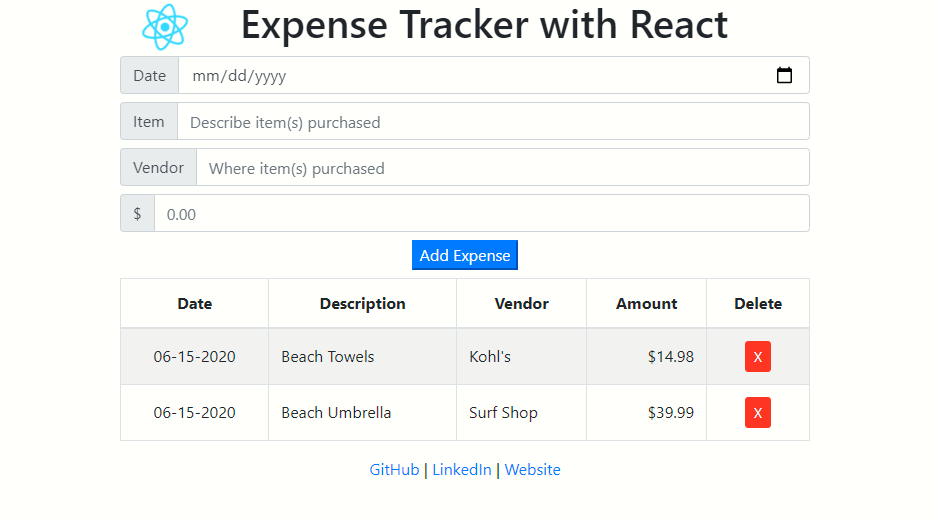

# Expense Tracker App
A simple expense tracker application, built with React/Node.js, Bootstrap v4, Moment.js, and deployed via Heroku

This project was bootstrapped with [Create React App](https://github.com/facebook/create-react-app).

## Links
[View Application on Heroku](https://arcane-peak-81489.herokuapp.com/)  
[View GitHub Repository](https://github.com/jazfunk/expense-tracker-react-app.git)


## Application Image
  


## Summary
With my first entry into React development, this expense tracker came together rapidly.  The use of class and functional components were relatively easy to understand and implement.  This type of logic lends itself to keeping the code succinct, and manageable.

It was an awakening to discover the complexity of what goes on behind the scenes when setting up a React application.  After breaking down each step, it was less-mysterious, but I'm still in awe of the sheer power and automatic configurations that occur.

Incorporating Bootstrap for styling, and Moment.js for date formatting, was equally astounding.  In this project, I didn't find myself going down the design phase and formatting "rabbit hole".  Just selecting the desired class shaved hours from the total development time.

Deploying to Heroku proved to be difficult, at first.  After debugging and researching, I discovered that I missed one simple step.  Once I went through it again, it was a breeze using the zero configuration method.  Again, what is going on behind the scenes, automatically, is quite impressive.

While the level of difficulty in these technologies and methods is at a high level, the yield in greater productivity, in a short period of time, is well worth the trade off.  I can see the potential in powerful development for my future projects.

## Prerequisites & Installation
This project requires the following to be installed to run locally:
* [Node](https://nodejs.org/en/)
* Npm

Installing Node will provide access to `npm`.

After Node/Npm installation is complete, run the web server:
```
npm start
```

Run app in the development mode:  Open [http://localhost:3000](http://localhost:3000) to view it in the browser.


## Built With
* [React](https://reactjs.org/docs/getting-started.html)
* [Node](https://nodejs.org/en/)
* [Boostrap v4](https://getbootstrap.com/docs/4.0/getting-started/download/)
* [Moment.js](https://momentjs.com/)

## Deployment
* [Heroku](https://www.heroku.com)

## Author
* **Jeff King** - *Full Stack Software Developer* - [GitHub](https://github.com/jazfunk) | [LinkedIn](https://www.linkedin.com/in/jeffking222/) | [Website](https://jeff-king.net)
